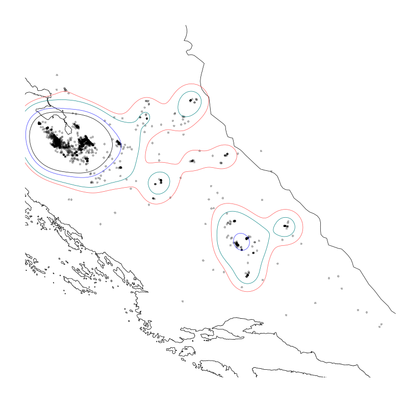

# telemetry

## Uvod
Skripte za obradu telemetrijskih podataka iz Ecotone GPS trackera.

## To-do:

* funkcija za vremensko filtriranje
* funkcija za filtriranje gnjezdišta (prostorno filtriranje)

## Vrste

### Aquila chrysaetos

Home range analiza, kernel density:

### Ichthyaetus audouinii
